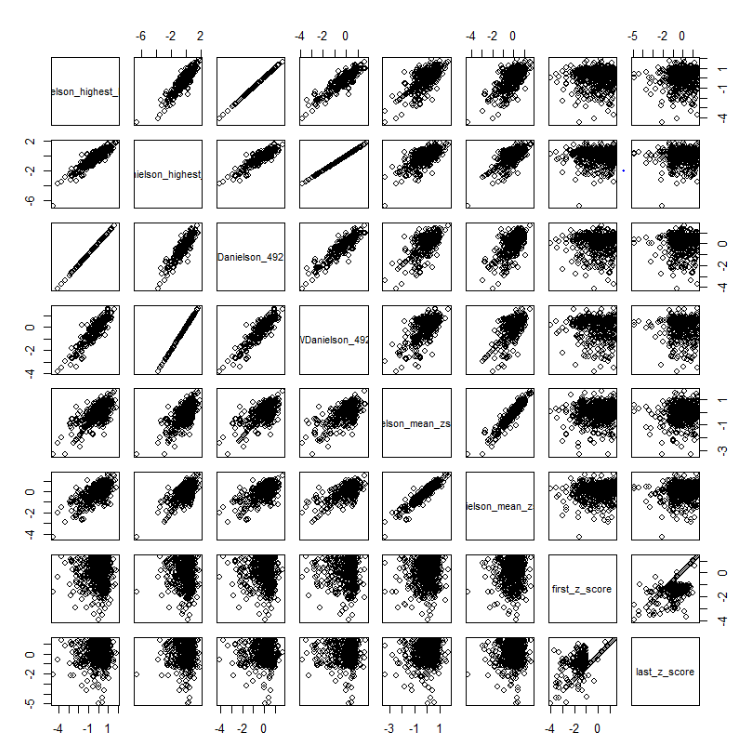
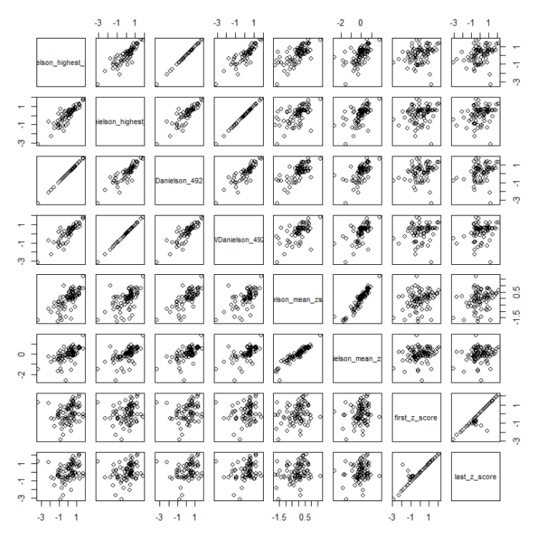
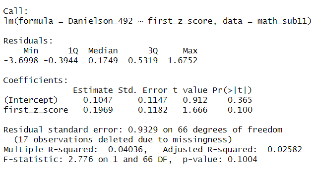
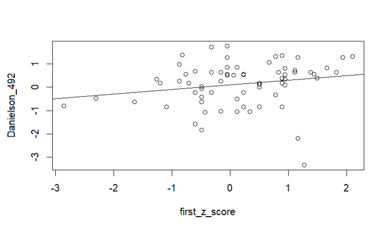
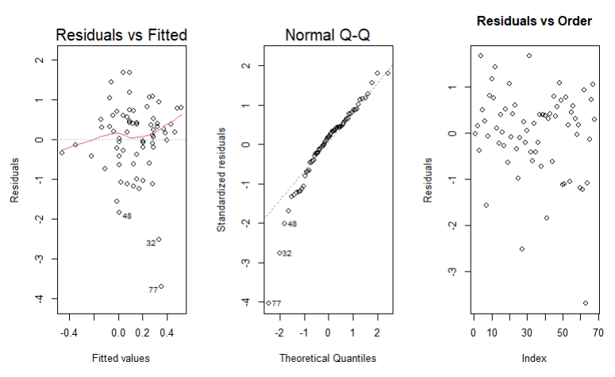
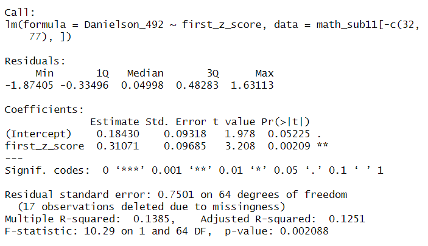
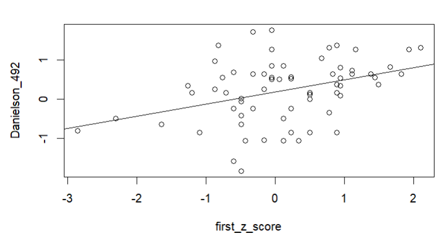

---
authors:
  - Ethan
date: 2024-06-03
categories:
  - Statistcs
  - Exploration
  - Senior Project
---

# Exploring the Predictive Power of Math Praxis Scores

Over the course of this semester I have been working with Brother Pacini to help him progress his dissertation. Much of my work has been focused on data cleaning, but at the request of Brother Pacini, I have recently taken a look into how Elem Ed: MS Mathematics Subtest praxis scores could predict teaching skill. 

We chose to look into this because in some research Brother Pacini had found, math praxis scores had shown strong prediction power for teaching ability and we would like to see if we could replicate that result with the data we have. For this work we do not have data about teaching abilities that were recorded after they began their first job, so our chosen response variable for this work is Danielson score.

<!-- more -->

## Selecting Data

To start this task I began by filtering down our dataset to just praxis results for the Elem Ed: MS Mathematics Subtest. From here I then decided to drop all columns except for possible explanatory variables and response variables. For our possible explanatory variables we chose to work with praxis z-scores, which can be found in the following columns

* `first_z_score`: The z-score of the first attempt score at the test, calculated in relation to all other first attempt scores.
* `last_z_score`: The z-score of the last attempt score at the test, calculated in relation to all other last attempt scores.

For our possible response variables we chose to work with all numerical columns related to Danielson score, the most notable columns are the following

* `Danielson_highest_level`: Danielson score for the class with the highest course code.
* `WDanielson_highest_level`: Weighted version of `Danielson_highest_level`.
* `Danielson_492`: Danielson score for the 492 course code.
* `WDanielson_highest_level`: Weighted version of `Danielson_492`.

## Finding a Correlation

After filtering our data set to numerical columns we can now explore the relationship between the columns with a pairs plot. Unfortunately, as seen below in the rightmost two columns, we don't see any great correlation between the Elem Ed: MS Mathematics Subtest scores and Danielson scores.



However, after failing to find any strong relationship with Elem Ed: MS Mathematics Subtest scores I then decided to see if I could find a singificant relationship between Danielson scores and praxis scores for any other math test. After creating similar pairs plots for each mathematics tests, I found a few tests that showed promising relationships, the most interesting one being Elem Ed: CKT Mathematics Subtest.



Outside of a few outlier points, our explanatory variables show what appears to be a strong relationship with all of our interested response variables.

## Exploring Elem Ed: CKT Mathematics Subtest

To start this exploration began by running the following linear regression model

```{r}
lm7813 <- lm(Danielson_492 ~ first_z_score, math_sub11)
```

Which yielded the following results

Model | Plot
:-------------------------:|:-------------------------:
  |  

While resulting in poor p-values and R-Squared, the model visually explains the data much better than most other models I have tried, so I decided to see if I could make it significant. When checking the regression assumption, which can be seen below, I noticed that the primary issues with this regression are two points, 32 and 77.



To make the model more significant, I decided to remove points 32 and 77, which yielded the following results

Model | Plot
:-------------------------:|:-------------------------:
  |  

With this small change our model went from becoming just okay to significant and interesting. 

## Next Steps

While the above model did show significant results, simply removing bad points to make it better is not what I would call sufficient exploration. I am interested in seeing if there is a valid reason for removing these points. To do this I plan to explore the factors that play into this data and see if filtering out one group could result in this significant model.

Not only do I think that figuring out this key factor could help this particular model, but I would also propose that it could improve some of the other regressions I tried on the other math praxis tests. The reason I think this is because while Elem Ed: CKT Mathematics Subtest shows promising prediction results, this may be due to the small sample size in comparison to tests like Elem Ed: MS Mathematics Subtest. I actually think that if we could sample more of Elem Ed: CKT Mathematics Subtest we would be seeing a similar pairs plot to Elem Ed: MS Mathematics Subtest.

However, if this is true, by finding the particular factor that makes our modeling of Danielson-Praxis prediction significant with the tests of smaller sampling size, we could possibly apply it to the tests of larger sampling size and find significant results.